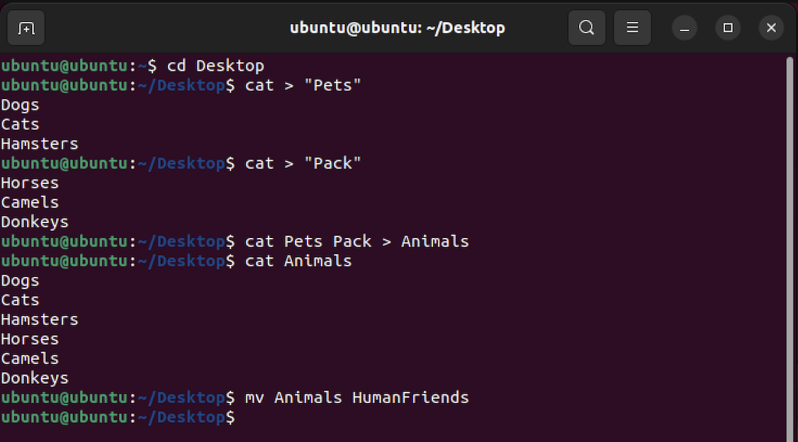
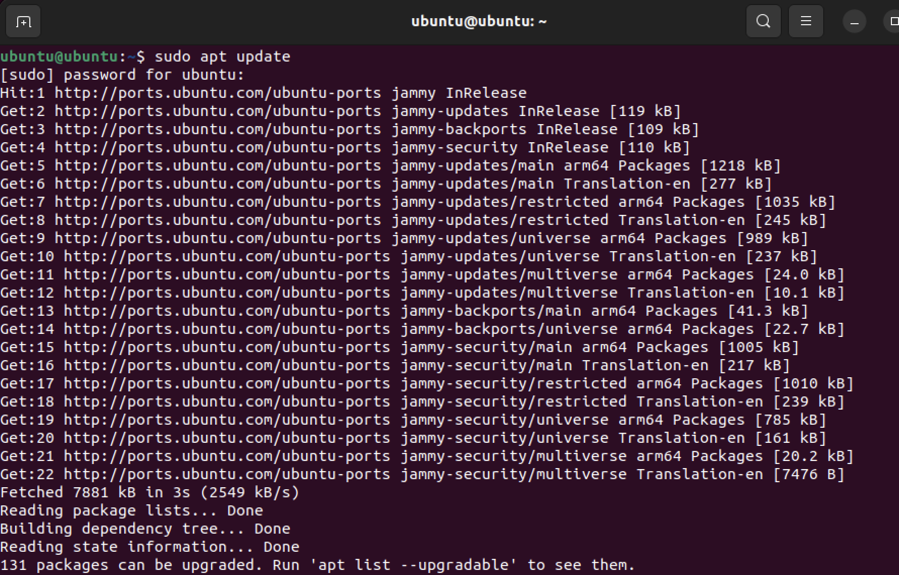

# Итоговая контрольная работа 
## Информация о проекте
Необходимо организовать систему учета для питомника в котором живут домашние и вьючные животные.

## Как сдавать проект

Для сдачи проекта необходимо создать отдельный общедоступный репозиторий(Github, gitlub, или Bitbucket). Разработку вести в этом репозитории, использовать пул реквесты на изменения. Программа должна запускаться и работать, ошибок при выполнении программы быть не должно. Программа, может использоваться в различных системах, поэтому необходимо разработать класс в виде конструктора

# Задание
1. Используя команду cat в терминале операционной системы Linux, создать два файла Домашние животные (заполнив файл собаками, кошками, хомяками) и Вьючные животными заполнив файл Лошадьми, верблюдами и ослы, а затем объединить их. Просмотреть содержимое созданного файла. Переименовать файл, дав ему новое имя (Друзья человека).

2. Создать директорию, переместить файл туда.

3. Подключить дополнительный репозиторий MySQL. Установить любой пакет из этого репозитория.

4. Установить и удалить deb-пакет с помощью dpkg.

 
5. Выложить [историю команд](/Bash_History.txt) в терминале ubuntu.
6. Нарисовать диаграмму, в которой есть класс родительский класс, домашние животные и вьючные животные, в составы которых в случае домашних животных войдут классы: собаки, кошки, хомяки, а в класс вьючные животные войдут: Лошади, верблюды и ослы.
7. В подключенном MySQL репозитории создать базу данных “Друзья человека”.
8. Создать таблицы с иерархией из диаграммы в БД.
9. Заполнить низкоуровневые таблицы именами(животных), командами которые они выполняют и датами рождения.
10. Удалив из таблицы верблюдов, т.к. верблюдов решили перевезти в другой питомник на зимовку. Объединить таблицы лошади, и ослы в одну таблицу.
11. Создать новую таблицу “молодые животные” в которую попадут все животные старше 1 года, но младше 3 лет и в отдельном столбце с точностью до месяца подсчитать возраст животных в новой таблице.
12. Объединить все таблицы в одну, при этом сохраняя поля, указывающие на прошлую принадлежность к старым таблицам.
13. Создать класс с Инкапсуляцией методов и наследованием по диаграмме.
14. Написать программу, имитирующую работу реестра домашних животных. \
**В программе должен быть реализован следующий функционал:** \
14.1 Завести новое животное. \
14.2 Определять животное в правильный класс. \
14.3 Увидеть список команд, которое выполняет животное. \
14.4 Обучить животное новым командам. \
14.5 Реализовать навигацию по меню.
15. Создайте класс Счетчик, у которого есть метод add(), увеличивающий̆ значение внутренней̆ int переменной̆ на 1 при нажатие “Завести новое животное” Сделайте так, чтобы с объектом такого типа можно было работать в блоке try-with-resources. Нужно бросить исключение, если работа с объектом типа счетчик была не в ресурсном try и/или ресурс остался открыт. Значение считать в ресурсе try, если при заведения животного заполнены все поля.